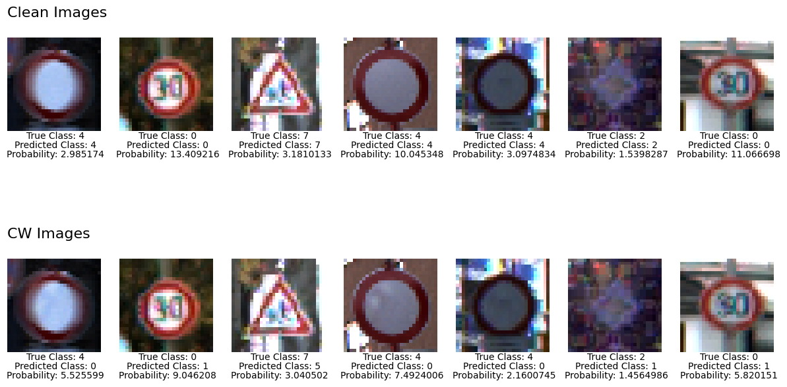
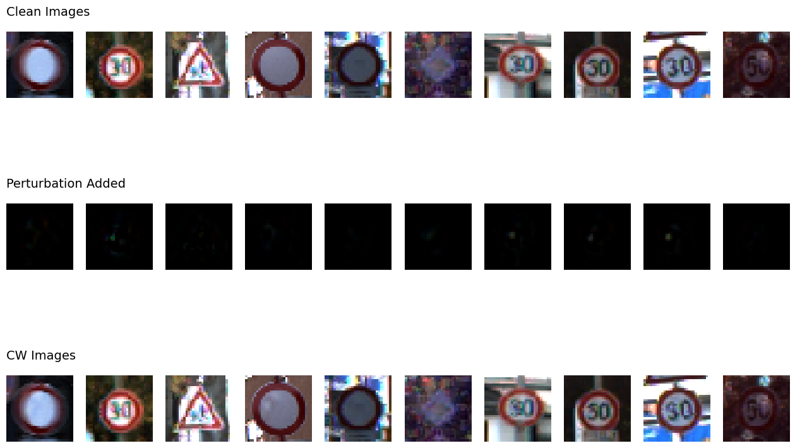

# Traffic Sign Classifier: Adversarial Robustness via Synthetic Data

**Can fake training data make an AI harder to fool?** This project tests whether augmenting a traffic sign classifier's training set with **synthetic images** — fake signs generated by a diffusion model — improves its resistance to adversarial attacks, without sacrificing accuracy on real images.

A self-driving car cannot afford to misread a stop sign. Yet the CNNs that read traffic signs can be fooled by **adversarial attacks**: tiny, carefully calculated changes to an image that flip the model's prediction while looking identical to a human. This project asks whether topping up the training data with diffusion-generated signs buys any defense against that.

> 📝 **Full write-up:** [Can Fake Training Data Make AI Harder to Fool?](https://signalsyntax.no) — the background, method, and findings explained for a general reader.

*Based on an unpublished 2024 course project.*

---

## Results

Two architecturally identical CNNs were trained — one on the original imbalanced [GTSRB](https://benchmark.ini.rub.de/gtsrb_dataset.html) subset, one on the same data balanced with synthetic images from a Diffusion Transformer (DiT). Both were attacked with two white-box methods: **Carlini-Wagner (CW)** and **DeepFool**.

| | Original model | Model with synthetic data |
|---|---|---|
| Accuracy on clean images | 97.67% | 96.22% |
| Accuracy under CW attack | 15.11% | 21.46% |
| Accuracy under DeepFool attack | 7.51% | **80.82%** |

Two takeaways:

- Synthetic data did **almost nothing for clean accuracy** (a slight drop). If raw accuracy is the only goal, this isn't the tool.
- But against **DeepFool**, the original model collapsed to 7.5% — basically useless — while the synthetic-augmented model held at **80.8%**. A large robustness gain. The defense was weaker but still real against the stronger CW attack.

### What a successful attack looks like

The classifier reads the clean signs correctly (top row), then misclassifies the near-identical attacked versions (bottom row):



The added noise is almost imperceptible. Here it is isolated — clean image, the perturbation alone, and the result:



---

## Approach

1. **Dataset** — A subset of GTSRB (8 of 43 sign classes, narrowed for hardware feasibility). The original set is heavily imbalanced — some classes have ~2,250 images, others ~210.
2. **Synthetic data** — A [Diffusion Transformer (DiT)](https://github.com/facebookresearch/DiT) was trained on the real signs and used to generate new images, balancing every class to 2,250 samples (~165 hours of generation on an RTX 3090).
3. **Model** — A "Standard CNN" (TensorFlow/Keras) based on Princeton's [DARTS](https://arxiv.org/abs/1802.06430) work: convolutional + dropout + max-pooling + dense layers.
4. **Attacks** — White-box, untargeted CW and DeepFool, implemented with IBM's [Adversarial Robustness Toolbox (ART)](https://github.com/Trusted-AI/adversarial-robustness-toolbox).
5. **Evaluation** — Clean accuracy, adversarial accuracy, and L2 perturbation distance for each model.

## Repository contents

```
.
├── traffic_sign_adversarial_robustness.ipynb   # Evaluation pipeline (GTSRB+DiT model)
├── requirements.txt
├── images/                                     # Result figures
└── README.md
```

The notebook covers the evaluation pipeline for the synthetic-augmented model: loading the trained model, measuring clean accuracy, crafting adversarial examples with ART, and measuring robustness.

## Reproducing this

The trained model weights (`.h5`) and the GTSRB+DiT image folders are **not included** in this repo due to size, so the notebook is meant to be **read as a documented pipeline** rather than run end-to-end out of the box. To reproduce:

1. **Get GTSRB** from the [official source](https://benchmark.ini.rub.de/gtsrb_dataset.html) and arrange 8 classes under `./gtsrb+dit/Train/<class_id>/`.
2. **Generate synthetic data** using the [DiT repo](https://github.com/facebookresearch/DiT), trained on the GTSRB classes, to balance each class to 2,250 images.
3. **Train the CNN** — the training cells are commented out in the notebook; uncomment to train, or supply your own `gtsrb+dit.h5`.
4. **Install dependencies:** `pip install -r requirements.txt`
5. **Run the notebook** to craft attacks and evaluate.

> ⚠️ This was a 2024 course project. Generative models have improved substantially since — the ~165h of generation would be far faster today, and attack/defense methods have evolved. Treat the specific numbers as a snapshot. The core finding — synthetic data can buy robustness, not just accuracy — is the part worth carrying forward.

## License

MIT — see [LICENSE](./LICENSE).

---

*Built by Kim Pellano · [Signal Syntax](https://signalsyntax.no) — ML engineering for computer vision, time-series, and physiological-signal problems.*
